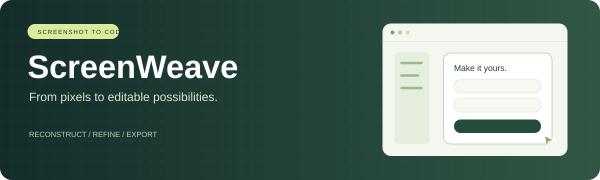
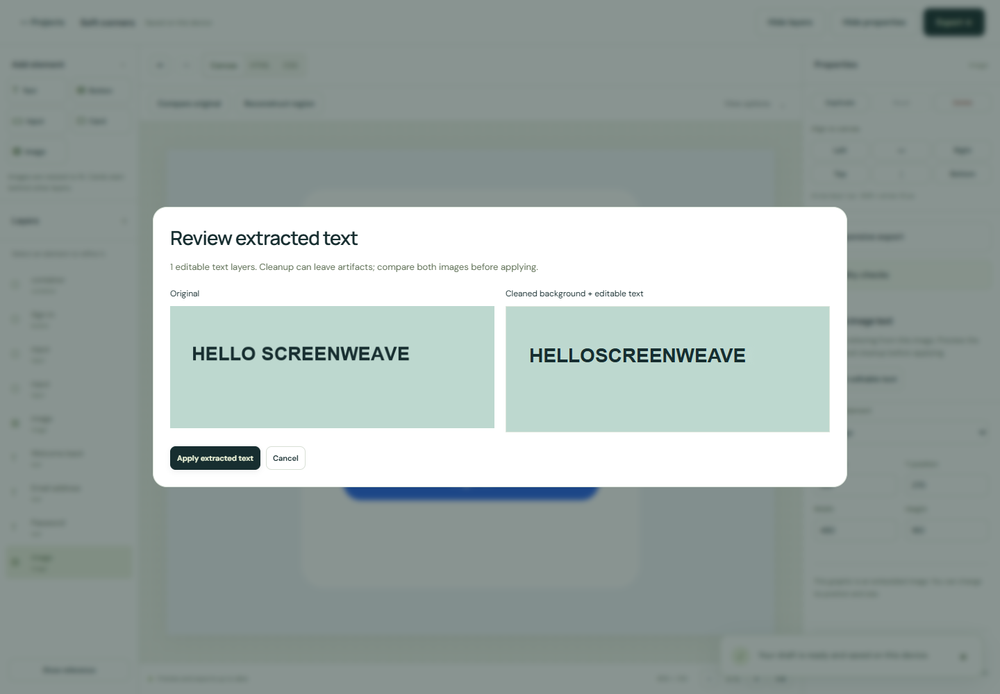
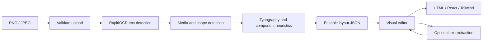
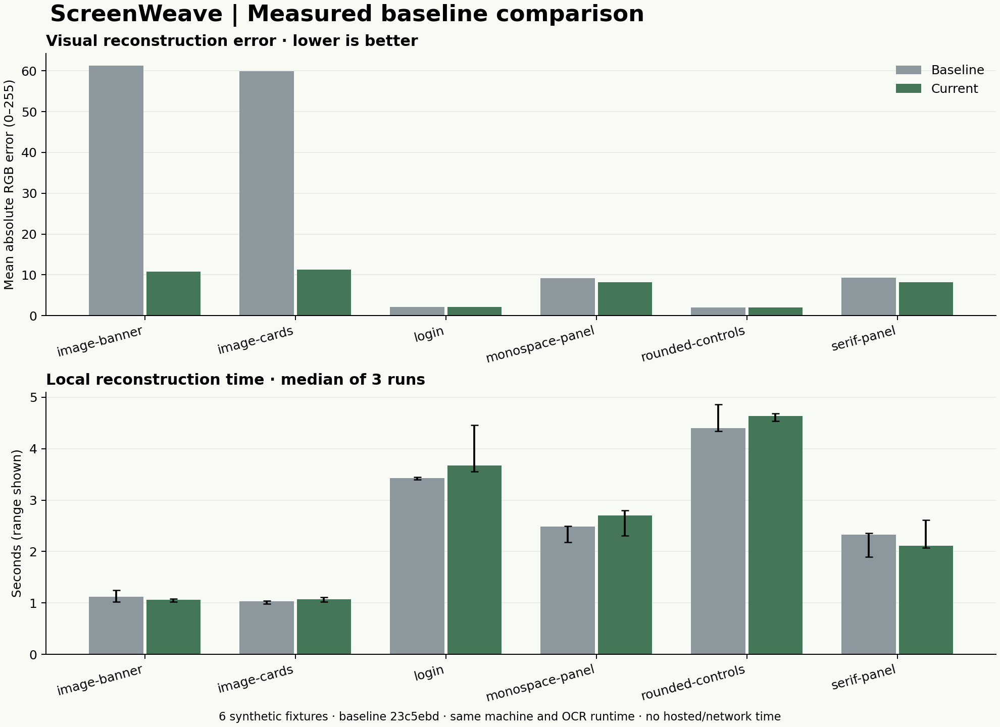

<div align="center">



**Turn interface screenshots into editable website foundations.**

[Open ScreenWeave](https://screen-weave.vercel.app) · [Backend dashboard](https://screenweave-api.onrender.com/dashboard) · [Evaluation](docs/evaluation/README.md) · [Deployment](docs/DEPLOYMENT.md)


</div>

## A screenshot is the starting point

ScreenWeave reconstructs a PNG or JPEG interface, lets you refine its layers, and exports a standalone HTML/CSS or React project. It combines pretrained OCR with computer-vision heuristics and keeps a human in the editing loop.

**No paid inference API is required.** The backend performs inference on CPU; users do not need a local GPU.

> Experimental reconstruction, not a pixel-perfect clone. The current system uses pretrained RapidOCR and geometry/texture heuristics. A custom-trained UI detector is future work.

## Reconstruct → refine → export

| Reconstruct | Refine | Export |
|---|---|---|
| Text, controls, containers and media regions | Drag, resize, align and edit layers | HTML + CSS |
| Curves, colors and three font families | Original/draft comparison slider and overlay | React + TypeScript + Vite |
| Whole photos and graphics | Selective region reconstruction | React + Tailwind CSS |
| Editable lettering inside images | Preview cleanup; apply, cancel or undo | Portable project backups |
| Optional mobile group stacking | Pixel-difference and overflow checks | Typed reusable React primitives |

### Editable text inside images

Select an image → **Extract editable text** → inspect the preview → **Apply extracted text**.

OCR locates lettering, OpenCV inpainting estimates the background underneath, and separate text layers are added over the cleaned image. Detailed backgrounds can leave artifacts. Cancel leaves the image unchanged; Undo restores it after applying.

<details>
<summary>See the extraction preview</summary>



OCR can miss spaces or misread text; the resulting layers remain editable.

</details>

### Responsive foundations

Enable **Responsive export → Stack groups on mobile**, then open **Preview screen sizes**. Below 640 px, inferred groups stack vertically; their internal contents scale proportionally. HTML, React and Tailwind exports share this behavior.

This does not recover the original site's responsive rules. Review grouping and text readability, then refine the generated CSS before publishing.

### React you can extend

Exports include `src/components.tsx` with typed `ReconstructedButton`, `ReconstructedInput`, `ReconstructedText`, `ReconstructedImage` and `ReconstructedCard` components. Instances share these primitives; the button accepts an `onClick` handler. Composite component discovery and business logic are not inferred.

## How it works



Projects are stored in IndexedDB on the current browser/device. The backend processes uploaded images without writing them to persistent application storage. Temporary export files are cleaned up after packaging. Its public dashboard shows aggregate diagnostics, not private images or logs.

## Measured results



Exploratory results on **six synthetic screenshots**, compared with baseline commit `23c5ebd` in the same local OCR environment:

| Metric | Baseline | Current |
|---|---:|---:|
| Mean per-case RGB MAE, 0–255 ↓ | 23.953 | 7.092 |
| Mean per-case median reconstruction time, seconds | 2.466 | 2.542 |

Most of the visual-error reduction comes from preserving textured image regions. Login and rounded-control errors were unchanged. Three timing runs per case exclude exports, network latency and hosted startup.

**These are development fixtures, not a held-out real-world accuracy benchmark.** They do not establish model accuracy, generalization or production latency. Optional text extraction and responsive stacking were not enabled in this comparison.

[Methodology and reproduction](docs/evaluation/README.md) · [CSV](docs/evaluation/results.csv) · [Raw measurements](docs/evaluation/results.json) · [Visual examples](docs/evaluation/visual-comparison.png)

## Run locally

Requirements: Python 3.12 and Node.js 20.19+ or 22.12+.

```bash
git clone https://github.com/AyushPandey218/ScreenWeave.git
cd ScreenWeave
python -m venv .venv
```

Activate with `.venv\Scripts\activate` on Windows or `source .venv/bin/activate` on macOS/Linux.

```bash
pip install -r backend/requirements-ocr.txt
python -m uvicorn app.main:app --app-dir backend --host 127.0.0.1 --port 8000
```

Linux also needs OpenCV system libraries and Liberation fonts; see [Dockerfile](backend/Dockerfile). Matching uses Arial/Times/Courier on Windows and Liberation equivalents on Linux.

In another terminal:

```bash
cd frontend
npm ci
npm run dev
```

The frontend defaults to `http://127.0.0.1:8000`. Copy `frontend/.env.example` to `frontend/.env` to change `VITE_API_URL`.

## Deployment

- **Vercel:** root `frontend`; build `npm run build`; output `dist`; set `VITE_API_URL` before building.
- **Render:** use `render.yaml` and the backend Dockerfile; set `ALLOWED_ORIGINS` to your exact frontend origin without a trailing slash.
- **Backend routes:** `/health`, `/dashboard`, `/docs`, `/reconstruct`, `/render`, `/extract-text`.

See the [deployment guide](docs/DEPLOYMENT.md). An idle hosted service may take time to wake up; availability depends on provider limits and terms.

## Development

```bash
pip install httpx
python -m unittest discover -s backend -p "test_*.py"
npm --prefix frontend run build
```

[Contributing and browser tests](CONTRIBUTING.md) · [Evaluation scripts](scripts)

```text
backend/             API, OCR, detection and exporters
frontend/            Editor, local projects and quality checks
scripts/             Evaluation and chart generation
tests/fixtures/      Synthetic screenshots
docs/                Deployment notes and measured results
```

## Practical limits

- PNG/JPEG: at most 5 MiB and 4 megapixels. Inference jobs are serialized.
- Up to 500 editable elements. Large embedded assets may be downscaled.
- Recognition, fonts, image boundaries and component types are estimates.
- Inpainting may damage background detail. Preview before applying.
- Clearing browser data removes local projects; download backups for portability.
- Generated code provides appearance, not authentication, payments or application backend logic.

## Research direction

Next: an annotated real-world screenshot set split by unseen template family, component precision/recall/IoU, OCR character error rate, and human correction effort. A lightweight trained UI detector and learned background cleanup remain future work. Training curves will be reported only after an actual training experiment.

Built by **Ayush Pandey** · [GitHub](https://github.com/AyushPandey218)
