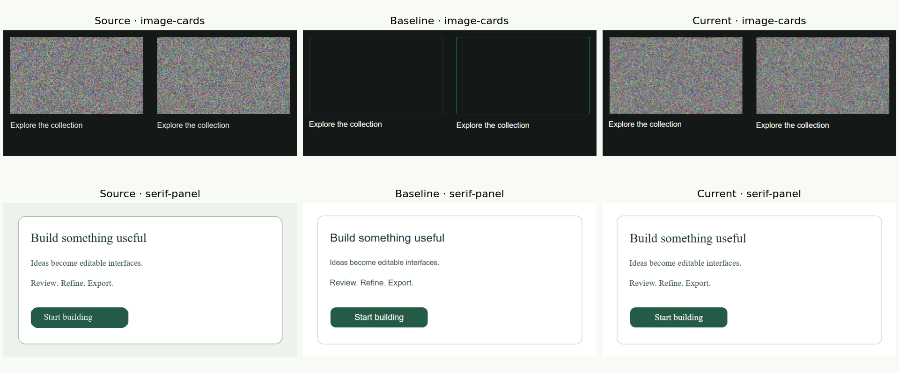

# Exploratory reconstruction evaluation

This is a development comparison, **not a trained-model accuracy claim**.

## Setup

Six synthetic fixtures cover login, rounded controls, two textured-media cases, a serif panel and a monospace panel. Baseline commit `23c5ebd` predates large-media preservation and expanded font matching. Current results use the reconstruction pipeline in this repository. Optional text extraction and mobile stacking are excluded.

Both versions use the same installed Python/OCR environment on one Windows machine. Each image is reconstructed three times, constructing the OCR engine for every request. Timings exclude exports, browser rendering, network and hosting startup. Background system load was not controlled; three runs do not support strong performance conclusions.

HTML is rendered at the original viewport in the same Edge browser, device scale 1. Raw timing samples, browser/Python/platform metadata and exact input hashes are in [results.json](results.json).

## Metrics and interpretation

- **RGB MAE:** mean absolute difference over all pixels and channels (0–255). Lower is better. The README averages the six per-image scores equally.
- **Pixels over 25 (%):** proportion of pixels with mean channel error greater than 25; included in the CSV.
- **Time:** median of three runs, with observed min/max whiskers, not confidence intervals.

Mean per-case MAE changes from 23.953 to 7.092, mainly from improved media preservation. Login and rounded-control errors are unchanged. Mean per-case median duration changes from 2.466 s to 2.542 s.

RGB error depends on background coverage, fonts and antialiasing. It does not measure semantic correctness, accessibility or code quality. No classification accuracy, mAP, SSIM, OCR CER or training/validation curves are claimed.




## Reproduce

From the repository root with the virtual environment active:

```bash
pip install -r backend/requirements-evaluation.txt
git archive --format=zip --output=baseline.zip 23c5ebd backend
python -m zipfile -e baseline.zip reports/evaluation-baseline
python scripts/evaluate_reconstruction.py --backend reports/evaluation-baseline/backend --output reports/evaluation/baseline --label 23c5ebd --runs 3
python scripts/evaluate_reconstruction.py --backend backend --output reports/evaluation/current --label current --runs 3
npm --prefix frontend install --no-save --package-lock=false playwright
node scripts/render_evaluation.cjs /absolute/path/to/frontend/node_modules/playwright reports/evaluation/baseline reports/evaluation/current
python scripts/plot_evaluation.py
```

The renderer defaults to Edge. Other platforms can set `BROWSER_CHANNEL=chromium` and install Chromium with Playwright first. Environment differences can change pixels and timings.

Checked-in fixtures are the exact measured inputs. `python scripts/generate_evaluation_fixtures.py` regenerates them using locally available fonts, which may change hashes on other operating systems.

## Limitations and next experiment

These fixtures exercise known development cases and are not held out. Media thresholds were tuned during development. Textured regions are generated, not a natural-photo dataset. This small set cannot establish generalization.

For an academic benchmark, collect consented/licensed real screenshots with element boxes, types and text annotations. Split by template family before tuning, then report detection precision/recall/IoU, OCR CER, visual error, latency and correction effort on the held-out split. Publish failures and raw predictions alongside the graphs.
